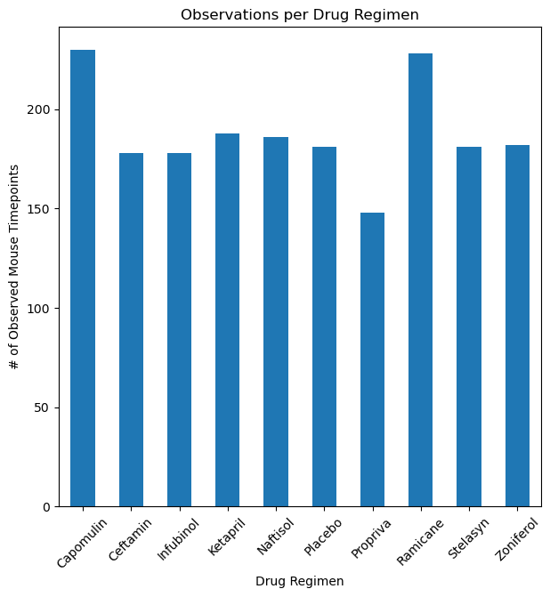
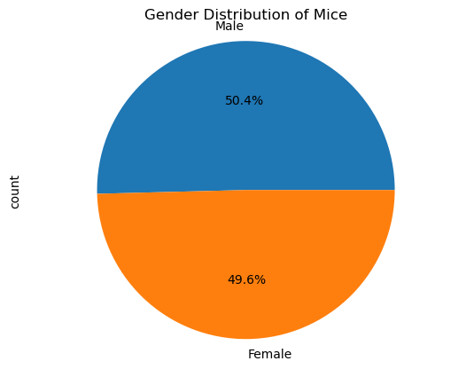
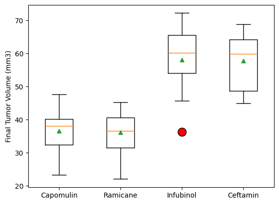
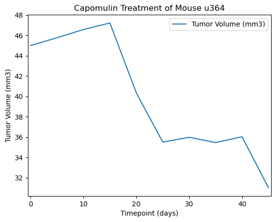
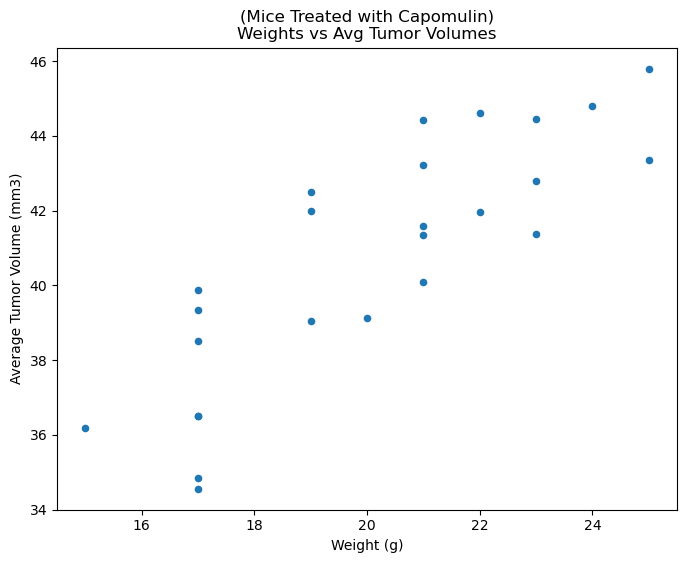
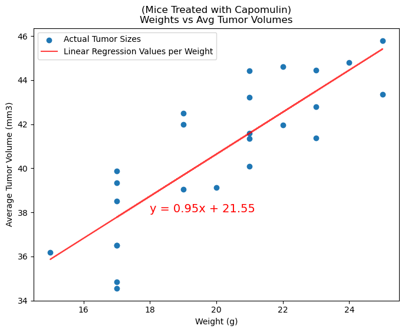

# Matplotlib Challenge - Pymaceuticals
`Module 5`  
`EdX(2U) & UT Data Analytics and Visualization Bootcamp`  
`Cohort UTA-VIRT-DATA-PT-11-2024-U-LOLC`  
`By Neel Kumar Agarwal`  

## Table of Contents  
1. [Introduction](#introduction)  
2. [Challenge Overview](#challenge-overview)  
3. [Variables/Breakdowns](#variablesbreakdowns)  
    - [Relevant Variables](#relevant-variables)  
    - [Summary Breakdowns](#summary-breakdowns)  
3. [Setup and Usage](#setup-and-usage)  
    - [Prerequisites](#prerequisites)  
    - [Instructions](#instructions)  
    - [Limitations](#limitations)  
4. [Files and Directory Structure](#files-and-directory-structure)  
5. [Expected Results](#expected-results)  
6. [Final Analysis](#final-analysis)  


> [!NOTE]  
> Regarding citations...  
> No citations were needed for the completion of this challenge. "Starter Code" was  
> given by edX/2U to help guide students partaking in their program in initially  
> setting up the Jupyter Notebook. Other than that, all Source Code found in the  
> Notebook and in this README.md was written originally by @Neelka96  


## Introduction  
*Roleplay...*  
You've just joined Pymaceuticals, Inc., a new pharmaceutical company that  
specializes in anti-cancer medications. Recently, it began screening for potential  
treatments for squamous cell carcinoma (SCC), a commonly occurring form of skin cancer.  

As a senior data analyst at the company, you've been given access to the complete  
data from their most recent animal study. In this study, 249 mice who were identified  
with SCC tumors received treatment with a range of drug regimens. Over the course of  
45 days, tumor development was observed and measured. The purpose of this study was  
to compare the performance of Pymaceuticals’ drug of interest, Capomulin, against the  
other treatment regimens.  

The executive team has tasked you with generating all of the tables and figures needed  
for the technical report of the clinical study. They have also asked you for a top-level  
summary of the study results.  

[:arrow_up: Return to TOC](#table-of-contents)  


## Challenge Overview  
This assignment is broken down into the following tasks:  
- Prepare the data.  
- Generate summary statistics.  
- Create bar charts and pie charts.  
- Calculate quartiles, find outliers, and create a box plot.  
- Create a line plot and a scatter plot.  
- Calculate correlation and regression.  
- Submit final analysis.  

The Pymaceuticals .ipynb is a Python-interactive Jupyter notebook that takes raw data  
from a test study of mice with tumors, transforms it into usable information, and  
creates graphical presentations of different variables and their relationships. The  
exact process consists of extracting raw data, combining data together for usability  
and portability, cleaning our merged data, and then using it to create palpable  
summaries and charts detailing the effectiveness of different drug regiments.  

Pymaceuticals was developed and currently runs on a conda based local python  
environment. Python version used is `3.12.7` running with imported dependencies of  
`pathlib`, `random`, `pandas`, `matplotlib`, and `scipy`. The files Mouse_metadata.csv  
and Study_results.csv were imported and read into two Pandas DataFrame objects.  
The two frames were checked for holes in their data types (NaN). After merging the two  
DFs on their column axis by the unique ID of the mice involved in the study, another  
scan over the newly merged DF was done but this time to check for any duplicate  
information found under data identifiers.  

The identifying labels for each datapoint consists of a mouse ID and the timepoint the  
data was measured at (days since study started for mouse). Each mouse ID's timepoints  
must be unique to that ID. For any ID found with duplicate timepoints, all data  
associated with said ID must be removed to ensure data integrity.  

> [!NOTE]  
> In the case of a majority duplicates, a different course of action would be taken  
> to maintain a usable amount of datapoints, however only one mouse ID was found and  
> thusly removed from the set.  

After cleaning has been completed, the study's data has been combined with its  
corresponding mouse ID to give access to the mouse's data at every datapoint. Summary  
statistics of tumor by drug treatment is calculated, graphs visualizing the usage of  
each drug in the study and distribution of mice by gender are rendered, and then  
outliers are found quantitatively and qualitatively. Last of all, 


[:arrow_up: Return to TOC](#table-of-contents)  


## Variables/Breakdowns  
### Relevant Variables:  
```
- Mouse Data  
    - Mouse ID  
    - Drug Regimen  
    - Sex  
    - Weight (g)  
- Study Data  
    - Mouse ID  
    - Timepoint  
    - Tumor Volume (mm3)  

- Datapoint identifiers  
    - Mouse ID  
        -Timepoints  
```  
[:arrow_up: Return to TOC](#table-of-contents)  


### Summary Breakdowns:  
- Loading Station & Data Cleanup  
    - Setup for Imports, CSVs, and DataFrames  
    - Locating Duplicate Mice by ID and Timepoint  
    - Duplicate Mice Data
    - Cleaned DataFrame
- Summary Statistics  
- Bar and Pie Charts  
- Quartiles, Outliers and Boxplots  
- Line and Scatter Plots  
- Correlation and Regression  

[:arrow_up: Return to TOC](#table-of-contents)  


## Setup and Usage  
### Prerequisites  
- Python 3.x  
- Standard libraries: `pathlib`, `random` (included with Python)  
- Non-standard library: `pandas`, `matplotlib`, `scipy`  
- IDE that supports Jupyter Notebooks with Python  

[:arrow_up: Return to TOC](#table-of-contents)  


### Instructions  
1. Clone this repository.  
2. Ensure IDE is up to date and running.  
3. Ensure the two input CSV files are in the `data` sub-folder.  
4. Open `main.ipynb` in your IDE and run all cells.  
5. If the necessary dependencies aren't found install using the following methods:  
    - For *pip*  
        ```  
        pip install pathlib  
        pip install random  
        pip install pandas  
        pip install matplotlib  
        pip install scipy  
        ```  
    - For *anaconda*  
        ```  
        conda install pandas  
        conda install matplotlib  
        conda install scipy  
        ```  
> [!WARNING]  
> Please note that neither *pathlib* nor *random* was installed using conda.  
> *pathlib* and *random* are base modules almost always included with Python  
> installations. It is recommended to use `pip install` for these two modules.  
6. **Results will print throughout the Jupyter Interactive Notebook**  

[:arrow_up: Return to TOC](#table-of-contents)  


### Limitations  
- [ ] Graphed results are qualitative not quantitative    
- [ ] Time frame for DataFrames is limited up to 45 days instead of an open dynamic range  

[:arrow_up: Return to TOC](#table-of-contents)  


## Files and Directory Structure  
```  
matplotlib-challenge/
|
|— Pymaceuticals/
|   |— data/
|   |   — Mouse_metadata.csv
|   |   - Study_results.csv
|   |— main.ipynb  
|   |- README.md
```  
This structure ensures all inputs are organized within their respective folders.  

[:arrow_up: Return to TOC](#table-of-contents)  


## Expected Results  
Results from this code are solely for viewing in the Jupyter Notebook. As many  
dependencies have already been loaded into the code it is needless to add another  
just to print the graphs outside of the main.ipynb file. Please see the `Tip` for  
a Jupyter Notebook traversal suggestion.

> [!TIP]  
> Collapsing of various regions or use of `OUTLINE` in VSCode can  
> speed up exploration of the Notebook.  

The following are examples of the expected results from the matplotlib code running  
in the Jupyter Notebook:

1. This Bar Chart shows the number of timepoints contained in ecah drug regimen (aka number of total doses).  
  
  
2. This pie chart depicts the percent of whole gender distribution of the mice in this experiment.  
  
  
3. This boxplot displays the inner and outer quartile ranges of the top 4 performing drug regimens in the study.  
  
  
4. This line graph is randomly generated each time the code is run, as the challenge called for 'a mouse', and not a specific or consistent one throughout.  
The line graph is for the volume of its tumor over its timepoints in the study.  
  
  
5. This scatter plot is for the purposes of displaying a single mouse's average tumor size vs the weight of that same mouse.  
  
  
6. The chart uses the previous scatter plot but layers a linear regression drawn line on top of it, along with an annotation for the equation of that line.  
  

[:arrow_up: Return to TOC](#table-of-contents)  


## Final Analysis  
While the study was held for the purpose figuring out which drug regimen was  
the most successful in treating squamous cell carcinoma (SCC), it also shed a  
light on how mice in general react to anti-cancer drugs and solutions. Distributions  
within different groupings are largely similar enough to compare and of a big  
enough size to analyze in the first place.  

Finding the highest performing treatments signals a few things:  
    1. The lowest tumor size mean of a drug regimen  
    2. Smaller median value for tumor size by drug  
    3. Lower standard deviation in tumor size  
    4. Final tumor sizes are the smallest  

The boxplot could be easily expanded to include all drug regimens, but based off  
the evidence accumulated from the summaries and using the following code a cleaner  
picture is painted as to how well the drugs perform.  
```
INPUT:

mean = clean_df_summary.sort_values('Mean Tumor Volume').iloc[:5, 0].index
median = clean_df_summary.sort_values('Median Tumor Volume').iloc[:5, 1].index
variance = clean_df_summary.sort_values('Tumor Volume Variance').iloc[:5, 2].index
std_dev = clean_df_summary.sort_values('Tumor Volume Std. Dev.').iloc[:5, 3].index
std_err = clean_df_summary.sort_values('Tumor Volume Std. Err.').iloc[:5, 4].index
rank = 1
print('          Mean     Median    Variance    Std Dev   Std Err')
print('-'*65)
for a,b,c,d,e in zip(mean, median, variance, std_dev, std_err):
    print(f'Rank {rank}: {a}, {b}, {c}, {d}, {e}')
    rank += 1
```
```
OUTPUT:

          Mean     Median    Variance    Std Dev    Std Err
-----------------------------------------------------------------
Rank 1: Ramicane, Ramicane, Ramicane, Ramicane, Ramicane
Rank 2: Capomulin, Capomulin, Capomulin, Capomulin, Capomulin
Rank 3: Propriva, Propriva, Ceftamin, Ceftamin, Ceftamin
Rank 4: Ceftamin, Ceftamin, Infubinol, Infubinol, Infubinol
Rank 5: Infubinol, Zoniferol, Propriva, Propriva, Zoniferol
```
The code separates the different columns and isolates the top five drugs  
for the mean, median, variance, standard deviation, and standard error.  
Based off of the summaries the top drugs are Ramicane, Capomulin, Propriva,  
Ceftamin, and Infubinol. However when viewed in the boxplot form, it has a wider  
range and margin of error than it's main competitors Ceftamin and Infubinol, and  
it's among the drugs with the least number of observations. Therefore, it makes  
sense that the boxplot requested was for the augmented top four drugs: Ramicane,  
Capomulin, Ceftamin, and Infubinol.  

As part of the analysis, a deeper look at the individual mice who received  
Capomulin was requested because it's a top contender. In order to tackle this,  
and because no specific mouse was requested, a random generator for any mouse  
that was treated with Capomulin was created so that during each runtime a random  
mouse was selected and graphed according to its timepoints and tumor volume.  
The randomly graphed mice that were treated with Capomulin almost always appear  
to have a downwards correlation between timepoints and tumor volume. However,  
this random generator could be further modulated and switched to a different drug  
regimen, and when used in examination of random mice that were treated with  
Ramicane the mice actually seem to outperform the mice that were treated with  
Capomulin. Further analysis could most certainly be used, especially a longer-term  
study or maintaining more detailed data sets of the mice in the study along with  
outcomes or side-affects of different drug regimens. Without said information,  
it is suffice to say with this data set that Ramicane and Capomulin are the best  
performing drug regimens for mice to take in countering squamous cell carcinoma  
(SCC).

[:arrow_up: Return to TOC](#table-of-contents)  